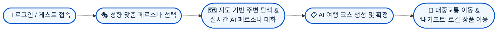

# 🌊 인천 메이트 (Incheon Mate)
> **"나의 여행 메이트와 함께하는 특별한 인천 여행"**  
> AI 페르소나와의 실시간 상호작용을 통해 개인 맞춤형 여행 코스를 생성하고 지역 상권을 연결하는 대화형 관광 플랫폼


## 1 프로젝트 개요

**인천 메이트(Incheon Mate)**는 인천국제공항 및 인천항을 통해 유입되는 국내외 관광객을 위한 **AI 기반 개인화 관광 어시스턴트 플랫폼**입니다.

기존 관광 플랫폼의 획일적인 리스트 나열과 일방향 정보 제공 방식에서 벗어나, **사용자의 성향(사상의학/페르소나)과 현재 위치·상황을 반영한 실시간 상호작용**을 제공합니다 단순한 장소 안내를 넘어 여행 중 친구이자 가이드 역할을 수행하며, AI 기반 여행 코스 생성 및 지역 상권 연계 커머스('내기프트')를 통해 풍부한 여행 경험을 지원합니다


## 2 기획 배경 및 문제 정의

| 기존 관광 서비스의 한계                                        | 인천 메이트(Incheon Mate)의 해결책                                     |
| :--------------------------------------------------- | :------------------------------------------------------------ |
| **획일적이고 정형화된 추천**<br>개인의 취향과 이동 패턴이 배제된 단순 인기 순위 제공  | **성향 맞춤형 AI 페르소나 가이드**<br>사용자 성향 및 여행 스타일에 따른 맞춤형 상호작용        |
| **수동적 정보 탐색의 피로도**<br>여행 중 매번 포털/지도를 개별 검색해야 하는 번거로움 | **선제적 장소 추천 & 대화형 코스 생성**<br>실시간 위치 기반 선제 알림 및 챗봇 기반 자동 일정 생성 |
| **단절된 오프라인 소비 경험**<br>관광 정보 탐색과 실제 지역 상점 혜택/소비 간의 분리 | **지역 상권 선물하기 플랫폼 연동**<br>'내기프트' API 연동을 통한 관광지 상품/숙박권 구매 및 선물 |


## 3 주요 기능

### 1. 대화형 AI 페르소나 가이드 & 선제적 추천
- **다양한 성향의 페르소나 선택**: 사용자 취향 및 사상의학 성향을 반영한 4종의 캐릭터 페르소나를 제공하여 개인화된 가이딩을 지원합니다
- **위치 기반 선제적 안내**: 사용자의 현재 위치와 이동 경로를 파악하여 인근의 핵심 명소나 맛집을 페르소나가 먼저 제안합니다
- **인증샷 및 추억 기록**: 방문한 관광지에서 페르소나 캐릭터와 함께 사진을 촬영하고 여행을 기록할 수 있습니다

### 2. AI 여행 코스 실시간 생성 및 최적화
- **자연어 챗봇 코스 빌더**: 여행 일정, 테마, 동행자 조건을 대화창에 입력하면 AI 에이전트(`LangChain`, `Claude`)가 최적의 당일 여행 일정을 자동 설계합니다
- **코스 확정 및 관리**: 추천받은 일정을 '여행 코스' 탭에 저장하고 한눈에 일정 순서와 상세 정보를 확인할 수 있습니다

### 3. 지도 기반 실시간 탐색 & 길찾기 연동
- **카테고리별 장소 탐색**: 주변 음식점, 카페, 관광지, 호텔 정보를 지도상에서 직관적인 핀으로 탐색할 수 있습니다
- **외부 지도 및 대중교통 길찾기**: 카카오맵(Kakao Map), 구글맵(Google Maps) 및 ODsay 대중교통 API를 연동하여 장소 상세 정보와 최적 이동 경로를 제공합니다

### 4.지역 상권 연계 선물하기 ('내기프트': [Link](https://shopuser.naegift.com/))
- **가맹점 관광 상품 연동**: 상세 장소 페이지 내 '선물하기' 버튼을 통해 제휴 플랫폼('내기프트')의 숙박권, 체험 티켓, 식음료 상품으로 직접 연결됩니다
- **상생형 생태계**: 단순 정보 제공을 넘어 실질적인 지역 소상공인 매출 증대와 로컬 관광 활성화에 기여합니다

### 5. 간편 인증 및 게스트 모드
- 카카오/구글 소셜 로그인 지원 및 별도 가입 절차 없이 즉시 둘러볼 수 있는 게스트 모드를 제공하여 초기 사용자 진입 장벽을 최소화했습니다

##  4 사용자 이용 흐름 (User Flow)



## 5 시스템 아키텍처 


##  6 기술 스택 
### Backend
- Language & Framework: Java 17, Spring Boot 4.0.0
- Security & Auth: Spring Security, OAuth2 Client (Google, Kakao), JWT
- Database & Cache: MongoDB, Redis (Data & Cache)
- Communication & Clients: Spring Cloud OpenFeign

### DevOps
- Container: Docker, Docker Compose
- Web Server: Nginx
- Cloud: AWS EC2, AWS DocumentDB

##  7 빠른 시작 (Dev용)

### 필수 요구사항
- Java 17+
- Docker & Docker Compose
- Gradle Wrapper (`./gradlew`)

### 설치 및 실행
```bash
# 저장소 클론
git clone https://github.com/RYUJEONGHUN/Capstone-Design.git
cd Capstone-Design

# 환경 설정 (.env)
cp .env.example .env
# .env 파일에서 필요한 값 수정

#외부 Docker 네트워크 사전 생성
docker network create incheon_mate_network

# Docker Compose로 실행
docker-compose -f dockcer-compose.yml up -d
```

#### 환경변수
```env
# 1. External APIs
ODSAY_KEY=your_odsay_api_key_here
KAKAO_KEY=your_kakao_rest_api_key_here

# 2. OAuth2 Client Credentials
GOOGLE_CLIENT_ID=your_google_client_id.apps.googleusercontent.com
GOOGLE_CLIENT_SECRET=your_google_client_secret
KAKAO_CLIENT_ID=your_kakao_rest_or_native_key
KAKAO_CLIENT_SECRET=your_kakao_client_secret

# 3. Security & Authentication
JWT_SECRET=your_custom_jwt_secret_key_minimum_32_characters_long
ADMIN_PASSWARD=your_admin_password_here

# 4. Service URLs & Endpoints
NAEGIFT_REWARD_URL=http://localhost:3000/reward/callback
```
### 접근 방법
- 웹: http://localhost:8080
- API 문서: http://localhost:8080/swagger-ui.html (Swagger 사용 시)

##  8 프로젝트 구조 
```text
Capstone-Design/
├── src/main/java/com/example/IncheonMate/
│   ├── chat/                  # AI 및 일반 채팅 기능
│   ├── common/                # 공통 모듈
│   │   ├── auth/              # OAuth2 소셜 로그인 및 인증 처리
│   │   ├── config/            # 전역 인프라 및 보안 설정 (CORS, Redis, Security, Swagger)
│   │   ├── exception/         # 전역 예외 처리 체계 (CustomException, GlobalExceptionHandler)
│   │   ├── filter/            # 로깅 및 추적 필터 (MDCLoggingFilter)
│   │   └── jwt/               # JWT 발급 및 검증 컴포넌트
│   ├── course/                # AI 생성 코스 기능
│   ├── curation/              # 큐레이션 기능
│   ├── member/                # 회원 도메인
│   ├── place/                 # 장소 도메인
│   ├── reward/                # 리워드 코드 도메인
│   └── route/                 # ODSAY 길찾기 도메인
├── src/main/resources/
│   ├── application.yml        # 애플리케이션 설정
│   └── logback-spring.xml     # Slf4j MDC 패턴 설정 XML
├── docker-compose.yml         # 개발용 컨테이너 오케스트레이션
├── docker-compose-prod.yml    # 배포용 컨테이너 오케스트레이션
├── Dockerfile
├── nginx.conf                 # 리버스 프록시 및 SSL 설정
├── reissue.sh                 # SSL 인증서 갱신/재발급 스크립트
└── build.gradle               # 의존성 관리
```

##  9 개발 팀 / 연락처 

| 이름  | 역할        | GitHub                                         |
| --- | --------- | ---------------------------------------------- |
| 류정훈 | AI 채팅/백엔드 | [@RYUJEONGHUN](https://github.com/RYUJEONGHUN) |
| 김재원 | 백엔드       | [@QAAAQ123](https://github.com/qaaaq123)       |
| 이희원 | 프론트엔드     |                                                |
| 이정환 | 디자인/프론트엔드 | [@jhlee-inu](https://github.com/jhlee-inu)     |


## 10 향후 계획
- 공공 API 기반 MCP도입: 공공데이터 포털 관광 API와 연계하여 최신 축제 및 공식 관광지 정보 실시간 제공
- 개인화 추천 알고리즘 고도화: 사용자 피드백 반영 및 멀티 에이전트 구조 고도화
- 성능 최적: 응답 지연 시간 단축


### 참고 자료
- 내기프트
	- Moblie: [Google Play](https://play.google.com/store/apps/details?id=com.naegift.app)
	- Web: [내기프트 Shop](https://shopuser.naegift.com/)
